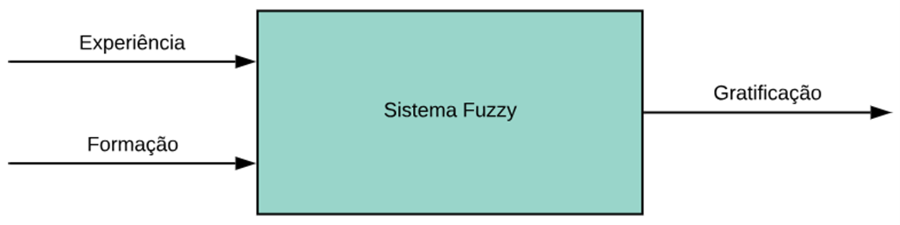
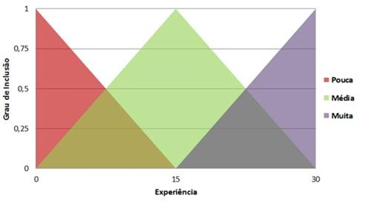
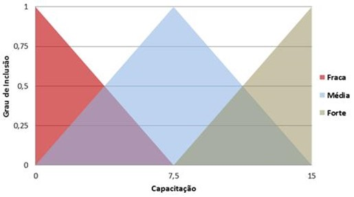
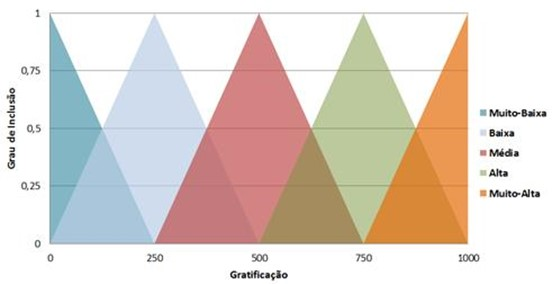
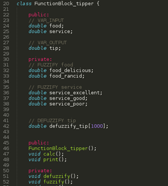
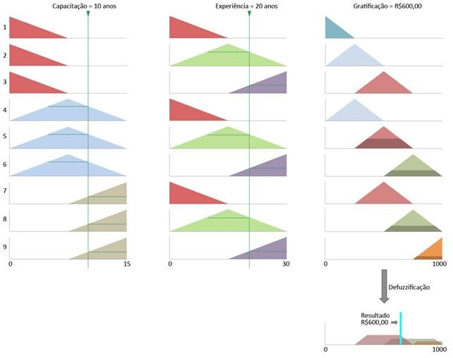

# Estudo de Caso: Lógica Fuzzy

O exemplo a seguir é um estudo de caso, que demonstra como é realizado o processo completo de modelagem de uma funcionalidade utilizando Lógica Fuzzy. Hipoteticamente, a necessidade é sinalizada pelo setor de RH de uma empresa, informando que é preciso agregar uma nova funcionalidade ao sistema atual.
O objetivo da nova funcionalidade é poupar o analista de RH da tarefa de determinar os valores de gratificações dadas aos funcionários, evitando a parcialidade e promovendo a isenção reivindicada pelo quadro de funcionários insatisfeitos.
##
Atualmente, o especialista (analista de RH) atem-se a dois critérios: 
•	Tempo de experiência 
•	Tempo de formação/capacitação

Diante deste cenário, o projetista (analista/desenvolvedor/programador) observa que a nova funcionalidade possui critérios nos quais as fronteiras de decisão não são óbvias, possuindo características de uma decisão estritamente humana, suscetível à parcialidade e equívocos tendenciosos. O projetista então conclui que a lógica da nova funcionalidade se encaixa nos conceitos da Lógica Nebulosa e decide pela técnica para a solução desejada.
Consultando mais detalhadamente o especialista, fonte de informação fundamental em um projeto com fuzzy, o projetista conclui que os critérios de experiência e de capacitação serão usados como variáveis de entrada do sistema, sendo a experiência expressa entre 0 e 30 anos, enquanto o tempo de capacitação é expresso entre 0 e 15 anos. A gratificação é a variável de saída, com valores entre R$0,00 e R$1.000,00. Estes intervalos são conhecidos como o universo de discurso das variáveis.

A próxima etapa do projeto é particionar o universo de discurso, ou seja, segmentar os intervalos de modo a poder atribuir a cada um deles um termo linguístico. Tais termos são a representação de como o especialista compreende as divisões internas dos critérios. 
O especialista relatou que lida com o cenário de pouca, média ou muita experiência para cada funcionário. No caso, compete ao especialista classificar se o tempo de experiência do funcionário se enquadra no rótulo pouca, média ou muita. A partir destas informações, definiu-se que a variável de entrada experiência se divide em três segmentos: pouca, média e muita, cuja variação de tempo ocorre no intervalo de 0 a 30 anos; conforme figura abaixo:

  

<strong>Figura 1.</strong> Conjunto fuzzy definido para a variável experiência. 
O tempo de capacitação também segue a mesma modelagem, a qual, o especialista também a rotula em 3 classes, no caso: fraca, média ou forte capacitação do funcionário. Tem-se então, a variável de entrada capacitação com valores numéricos indo de 0 a 15; conforme detalhado na <strong>Figura 2.</strong>

  

<strong>Figura 2.</strong> Conjunto fuzzy definido para a variável capacitação. 
De acordo com o especialista do RH, a saída, representada pela variável gratificação, foi dividida em cinco termos: muito baixa, baixa, média, alta e muito alta. Cada termo representaria uma classe de gratificação com valores associados que variam de 0 à R$1.000,00 de complemento de salário; vide a <strong>Figura 3.</strong>

  

<strong>Figura 3.</strong> Conjunto fuzzy definido para a variável de saída gratificação.

Com os intervalos e suas partições já especificados, o projetista precisa definir a forma dos conjuntos fuzzy, ou seja, a geometria da área de inclusão dos conjuntos, podendo ter diversas feições como: triangular, trapezoidal, gaussiana, etc.; sendo a mais simples e usual a forma triangular de comportamento linear.
Os critérios usados para a seleção da forma do conjunto podem ser imprecisos e incertos, por isso geralmente eles são selecionados através de tentativa e erro, através de experimentação continuada. Para os objetivos deste exemplo, foi arbitrada a feição triangular para todos os conjuntos.
Observando a Figura 2, nota-se que o profissional com 10 anos de capacitação seria avaliado pelo processo como parcialmente “Média” e parcialmente “Forte”, pois existe um grau de pertinência para estes dois conjuntos, sendo mais presente em “Média”. De forma similar, alguém com uma experiência de 20 anos estaria incluído nos conjuntos “Média” e “Muita”. Nota-se que os conjuntos de pertinência, ou seja, as formas triangulares, encaminham a ponderação feita pela lógica fuzzy, determinando a proporção de inclusão nos critérios específicos.
Na sequência, o especialista determina as regras que direcionarão a decisão feita pelo sistema. A constituição das mesmas se faz com o encadeamento de condições e uma conclusão, na forma:
SE <condição1> E <condição2> ENTÃO <conclusão>
A conclusão indica a qual conjunto a variável de saída pertence. As regras para o problema de valoração de gratificação, definidas pelo especialista, são as seguintes:

1.	SE capacitação é “Fraca” E experiência é “Pouca” ENTÃO gratificação é “Muito-Baixa”

2.	SE capacitação é “Fraca” E experiência é “Média” ENTÃO gratificação é “Baixa”

3.	SE capacitação é “Fraca” E experiência é “Muita” ENTÃO gratificação é “Média”

4.	SE capacitação é “Média” E experiência é “Pouca” ENTÃO gratificação é “Baixa”

5.	SE capacitação é “Média” E experiência é “Média” ENTÃO gratificação é “Média”

6.	SE capacitação é “Média” E experiência é “Muita” ENTÃO gratificação é “Alta”

7.	SE capacitação é “Forte” E experiência é “Pouca” ENTÃO gratificação é “Média”

8.	SE capacitação é “Forte” E experiência é “Média” ENTÃO gratificação é “Alta”

9.	SE capacitação é “Forte” E experiência é “Muita” ENTÃO gratificação é “Muito-Alta”

Uma vez definidos os conjuntos de pertinência e as regras, o sistema usando lógica nebulosa já pode ser implementado utilizando uma linguagem qualquer e uma API especialista que será responsável pela fuzzificação e defuzzificação. A API receberá as regras e os conjuntos fuzzy como parâmetros além das variáveis de entrada, de forma que gere a variável de saída gratificação. Existem diversas APIs disponíveis para executar a tarefa, por exemplo: a JFuzzyLogic (figura 4): http://jfuzzylogic.sourceforge.net/html/index.html.

  

<strong>Figura 4.</strong> Tela de código da API JFuzzyLogic. 
Uma visão segmentada do processo de fuzzificação e defuzzificação pode ser observada no diagrama da Figura 5, onde é avaliado o caso de um profissional com 10 anos de capacitação e 20 anos de experiência. O processo usa a capacitação e a experiência informada para rastrear as regras que foram ativadas e conclui que o profissional é merecedor de uma gratificação de R$600,00. Observando as regras já definidas e o diagrama da Figura 5, nota-se que as regras 5, 6, 8 e 9 foram ativadas por atenderem as condições impostas.

  

<strong>Figura 5.</strong> Processo de fuzzificação e defuzzificação. 
Por exemplo, a regra 5 foi ativada porque atendeu às duas condições necessárias: a capacitação é “Média” e a experiência é “Média”, levando a variável de saída gratificação a ter um valor proporcional ao grau de inclusão das duas condições atendidas. O grau de inclusão obtido no conjunto de saída em cada regra, representado pela área em negrito dos triângulos da variável gratificação, é definido por um cálculo matemático de responsabilidade da API. Com os graus de inclusão dos conjuntos fuzzy de gratificação já ponderados pela API (terceira coluna na direita do diagrama), a defuzzificação é efetuada, gerando a saída única, que é o valor de gratificação esperado como resultado final do processo de decisão nebuloso. 
Neste exemplo, o método de defuzzificação utilizado para obter o valor final, descrito no último gráfico, foi o Centro de Gravidade. Existem diversos métodos possíveis de serem utilizados nos processos de fuzzificação e defuzzificação executados pela API, de maneira que cada método efetua sua formulação matemática própria. O que ocorre no interior da API, como é esperado, fica totalmente transparente para o projetista e seu detalhamento não faz parte do escopo deste trabalho. 

O exemplo da determinação do valor de gratificação, apoiado pela lógica nebulosa, esclarece o processo de modelagem de uma solução orientada a regras de negócio, encontrada no dia-a-dia de muitos sistemas corporativos.
